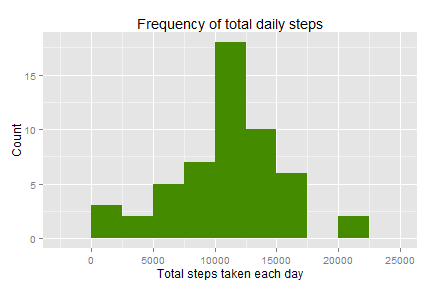
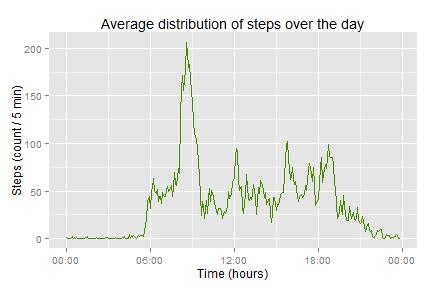
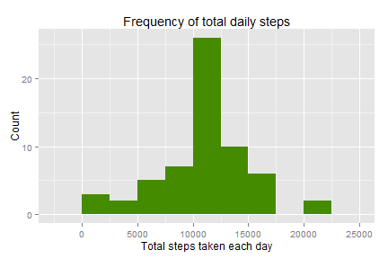
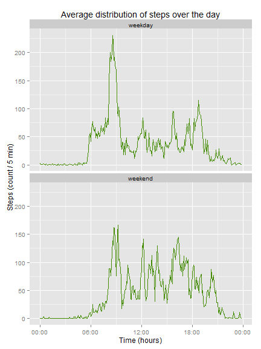

### Introduction

It is now possible to collect a large amount of data about personal movement using activity monitoring devices such as a [Fitbit](www.fitbit.com), [Nike Fuelband](http://www.nike.com/us/en_us/c/nikeplus-fuelband), or [Jawbone Up](https://jawbone.com/up). These type of devices are part of the "quantified self" movement - a group of enthusiasts who take measurements about themselves regularly to improve their health, to find patterns in their behavior, or because they are tech geeks. But these data remain under-utilized both because the raw data are hard to obtain and there is a lack of statistical methods and software for processing and interpreting the data.  

In the particular dataset studied is from a personal activity monitoring device. This device collects data at 5 minute intervals through out the day. The data consists of two months of data from an anonymous individual collected during the months of October and November, 2012 and include the number of steps taken in 5 minute intervals each day.

This report aims to explore this dataset and provide answers to a couple of questions arising from the data.

### Loading and preprocessing the data

loading required packages:

```r
require(dplyr)
```

```
## Loading required package: dplyr
## 
## Attaching package: 'dplyr'
## 
## The following object is masked from 'package:stats':
## 
##     filter
## 
## The following objects are masked from 'package:base':
## 
##     intersect, setdiff, setequal, union
```

```r
require(ggplot2)
```

```
## Loading required package: ggplot2
```

```r
require(lubridate)
```

```
## Loading required package: lubridate
```

```r
require(scales)
```

```
## Loading required package: scales
```

Loading the data:

```r
activity <- read.csv("activity.csv", stringsAsFactors=FALSE)
```

Preprocessing the data for easier  manipulation. Adding leading zero's so each interval consists of 4 digits.

```r
activity <- activity %>%
    mutate(date = ymd(date), time = sprintf("%04d", interval))
```


### What is mean total number of steps taken per day?

This question is answerd by calculating the total number of steps taken per day and creating a histogram.

```r
tot_activity <- activity %>%
    filter(!is.na(steps)) %>%
    group_by(date) %>%
    summarize(total_steps = sum(steps))
```


```r
ggplot(tot_activity, aes(total_steps)) +
    geom_histogram(binwidth = 2500, fill = "chartreuse4") +
    xlab("Total steps taken each day") +
    ylab("Count") +
    ggtitle("Frequency of total daily steps")
```

 

The mean and median of the total number of steps taken per day:


```r
summary(tot_activity$total_steps)[3:4]
```

```
## Median   Mean 
##  10760  10770
```

### What is the average daily activity pattern?

Calculating the average number of steps taken, averaged across all days, of the 5-minute interval.


```r
av_activity <- activity %>%
    mutate(time = as.POSIXct(strptime(activity$time, "%H%M"))) %>%
    filter(!is.na(steps)) %>%
    group_by(time) %>%
    summarize(average_steps = mean(steps))
```

Creating a time series plot


```r
ggplot(av_activity, aes(time, average_steps)) +
    geom_line(colour = "chartreuse4") +
    scale_x_datetime(labels = date_format("%H:%M")) +
    xlab("Time (hours)") +
    ylab("Steps (count / 5 min)") +
    ggtitle("Average distribution of steps over the day")
```

 

The 5-minute interval, on average across all the days in the dataset, with the maximum number of steps:


```r
tmp_activity <- activity %>%
    filter(!is.na(steps)) %>%
    group_by(time) %>%
    summarize(average_steps = mean(steps))

filter(tmp_activity, average_steps == max(average_steps))
```

```
## Source: local data frame [1 x 2]
## 
##   time average_steps
## 1 0835      206.1698
```

### Imputing missing values

Total number of missing values in the dataset:


```r
dim(activity)[1] - sum(complete.cases(activity))
```

```
## [1] 2304
```

To be able to impute the missing data, the assumption is made the time of day is most relevant.
Therefore, each case with missing number of steps is imputed by the same 5-minute time interval, averaged for the total number of days. For this the previously calculated tmp_activity can be reused. 


```r
na_activity <- left_join(activity, tmp_activity, by = c("time" = "time"))

na_activity <- na_activity %>%
    mutate(new_steps = ifelse(is.na(steps), average_steps, steps)) %>%
    select(-steps, -average_steps) %>%
    rename(steps = new_steps)

tot_na_activity <- na_activity %>%
    filter(!is.na(steps)) %>%
    group_by(date) %>%
    summarize(total_steps = sum(steps))
```

Histogram of the total number of steps taken each day:


```r
ggplot(tot_na_activity, aes(total_steps)) +
    geom_histogram(binwidth = 2500, fill = "chartreuse4") +
    xlab("Total steps taken each day") +
    ylab("Count") +
    ggtitle("Frequency of total daily steps")
```

 

The mean and median of the total number of steps taken per day:

```r
summary(tot_na_activity$total_steps)[3:4]
```

```
## Median   Mean 
##  10770  10770
```

The values differ from the estimates without the missing data imputed. The total number of steps has increased and the shape of the data has also been slightly impacted.

### Are there differences in activity patterns between weekdays and weekends?

Storing and changing language settings for consistent use:

```r
user_lang <- Sys.getlocale("LC_TIME")
Sys.setlocale("LC_TIME", "English")
```

```
## [1] "English_United States.1252"
```

Indicating whether a given date is a weekday or weekend day.

```r
wknd_activity <- na_activity %>%
    mutate(wkday = weekdays(date),
           wkndday = as.factor(ifelse(wkday == "Sunday"|wkday == "Saturday",
                            "weekend", "weekday"))) %>%
    select(-wkday)

wknd_activity <- wknd_activity %>%
    mutate(time = as.POSIXct(strptime(activity$time, "%H%M"))) %>%
    group_by(wkndday, time) %>%
    summarize(average_steps = mean(steps))
```

Creating a panel plot containing a time series plot (i.e. type = "l") of the 5-minute interval and the average number of steps taken, averaged across all weekday days or weekend days.


```r
ggplot(wknd_activity, aes(time, average_steps)) +
    geom_line(colour = "chartreuse4") +
    scale_x_datetime(labels = date_format("%H:%M")) +
    xlab("Time (hours)") +
    ylab("Steps (count / 5 min)") +
    ggtitle("Average distribution of steps over the day") +
    facet_wrap(~wkndday, nrow = 2, ncol = 1)
```

 

Restoring the language settings.

```r
Sys.setlocale("LC_TIME", user_lang)
```

```
## [1] "Dutch_Netherlands.1252"
```


